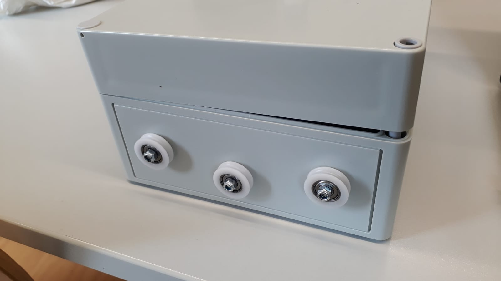
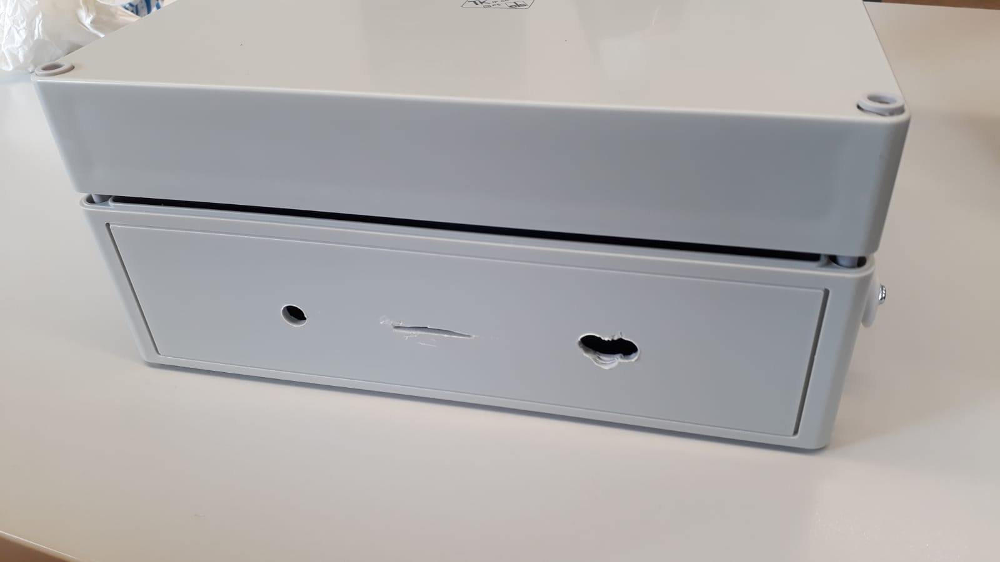
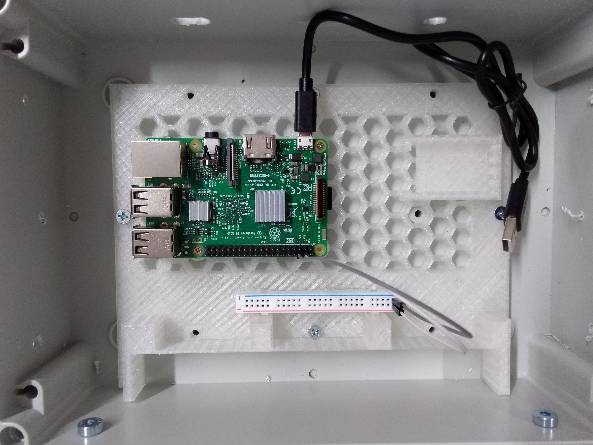
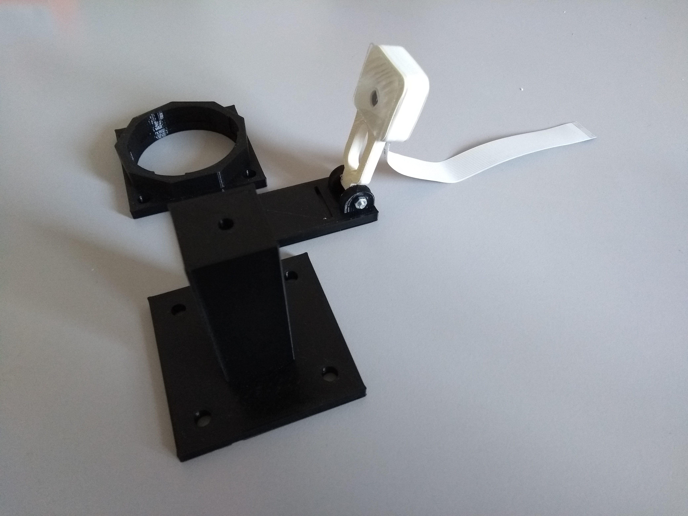
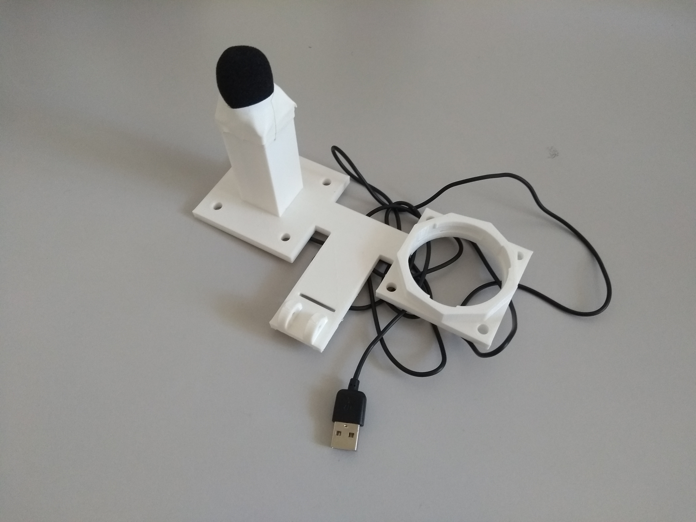

<h2>SensorBox Assembly</h2>

<h3>The Casing </h3>
The casing of the SensorBox needs to be prepared to safely host the microcontroller and protect it from environmental influences such as rain and UV-radiation. Also, the cables transmitting the signals from the environmental sensors need to reach the microcontroller without moisture entering the inside of the casing. Thirdly, the box needs wheels attached to it to ensure it can be used as a cable car between two ropes stretched along a tree. 

We created some <a href="assets/templates.pdf" >templates</a> which can be used to ensure to locate the correct positions to drill the holes. Make sure you use the short sides of the boxes to attach the wheels, while the upper long side of the box will be used to attach the sensor tower later. The attached wheels and the entrance of the cables from the sensor tower should look like this:

   

       
    

    

       
    

<h3>The Inlet</h3>
In the next step we attached a <a href="images/raspi_hex_mount_plate_V1.stl" >3D-printed plastic inlet</a> which is used to mount the Raspberry Pi as well as to stabilize the power-bank. After fixing the inlet, we place the Raspberry Pi with 4 small screws onto the placeholder for the microcontroller. We also stick an energy board with hot glue to connect the positive and negative line with the 3V-Input Pin and the Ground-Pin, respectively. 

<h3>The Sensor Tower</h3>
The sensor tower is attached to the box and hosts the environmental sensor: the lumen sensor, the temperature and humidity sensor as well as the camera and the microphone are all attached to the sensor tower. First, the <a href="https://github.com/Nature40/Sensorboxes-Images/tree/master/printdesigns/version_1/gondola"> 3-D printed components</a> of the sensor tower need to be assembled. 

   

       
    

    

       
    

<h3>Camera</h3>
insert cam v2 in 3d print holder(Sensorphalanx) and attach cable, close cap

<h3>Lumen Sensor</h3>
connect all jumpercables to lus and temp sensor
insert lux sensor to upper lamella (3d print)
combine all lamellas with metal spokes (metalspeichen)
insert tower with reclosable repeatable seal

<h3>Temperature Sensor</h3>
put temp sensor on lowest lamella

<h3>The Hall Sensors</h3>

- connect jumper calbes to sensores and raspy
- paste sensors 

<h3>The Real Time Clock</h3>
attach all cables to the raspy/clock 
seal cable channels with silicon
seal connections of phalanx to box with silikon
if needed paste temp tower with gluegun to phalanx