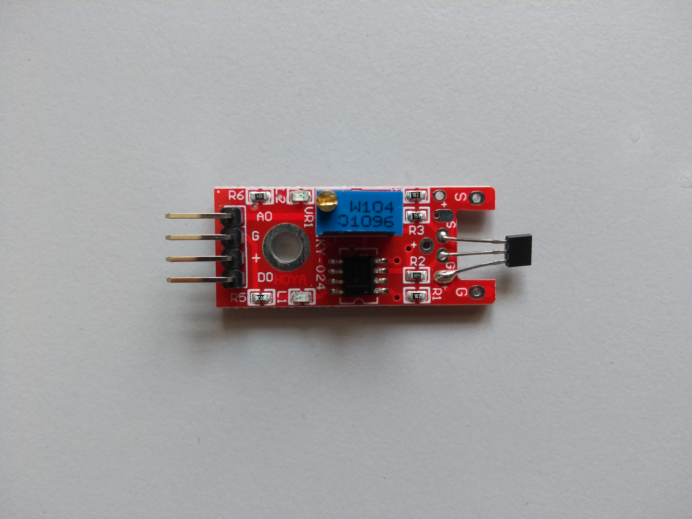

## Sensors

### Camera

------

#### General product information: 

Raspberry Pi Camera Module v2.1

#### Technical product information:

- Sensor: Sony IMX219 8 Megapixel sensor
- Supported formats: 1080p30, 720p60 and VGA90 
- Ribbon cable for CSI-port : 30 cm
- Interface: MMAL and V4L APIs

#### Manufacturer information:

[Raspberry Pi foundation](<https://www.raspberrypi.org/products/camera-module-v2/>)

Depending on your local retailer available for about 26 €

#### Sensor usage:

The camera is used to monitor the canopy from below crown surface. The collected data can be used to calculate the greenness-index to compare it with UAV generated aerial RGB-images. Further it can be used to monitor vegetational growth and animal wildlife detection.

#### Source code:

### Microphone 1 (expensive)

------

#### General product information:

#### Technical product information:

#### Retailer information:

#### Sensor usage:

The microphone is used to record the singing of birds. This data can be used by a machine learning algorithm to identify bird species. Bird species are an important indicator for biodiversity in forest ecosystems.

In the first stage of development two different models of microphones are tested to evaluate if a cheaper microphone is also suitable for bird species identification.

#### Source code:

### Microphone 2 (cheap)

------

#### General product information:

#### Technical product information:

#### Retailer information:

### 

#### Sensor usage:

The microphone is used to record the singing of birds. This data can be used by a machine learning algorithm to identify bird species. Bird species are an important indicator for biodiversity in forest ecosystems.

In the first stage of development two different models of microphones are tested to evaluate if a cheaper microphone is also suitable for bird species identification.

#### Source code:

### Temperature & Humidity Sensor

------

#### General product information:

DHT22 (AM2302) temperature-humidity sensor

#### Technical product information:

- 3 to 5V power and I/O
- 2.5mA max current use during conversion (while requesting data)
- Good for 0-100% humidity readings with 2-5% accuracy
- Good for -40 to 80°C temperature readings ±0.5°C accuracy
- No more than 0.5 Hz sampling rate (once every 2 seconds)
- Body size 15.1mm x 25mm x 7.7mm
- 4 pins with 0.1" spacing

#### Manufacturer information:

[Adafruit](<https://www.adafruit.com/product/385>)

Depending on your local retailer available for about 10 €

#### Sensor usage:

The temperature and humidity sensor is used to measure micro-climatic data. The lift-system allows to collect the data in a vertical range for advanced climatic modelling.

#### Source code:

### Light Sensor

------

#### General product information:

Adafruit TSL2591 High Dynamic Range Digital Light Sensor

#### Technical product information:

- Extremely wide dynamic range 1 to 600,000,000 Counts
- Lux Range: 188 uLux sensitivity, up to 88,000 Lux input measurements.
- Temperature range: -30 to 80 *C
- Voltage range: 3.3-5V into onboard regulator
- Interface: I2C
- This board/chip uses I2C 7-bit address 0x29 (fixed)

- Dimensions: 19mm x 16mm x 1mm / .75" x .63" x .04"
- Weight: 1.1g

#### Retailer information:

[Adafruit](<https://www.adafruit.com/product/1980>)

Depending on your local retailer available for about 6 €

#### Sensor usage:

The digital light sensor gathers information about the light intensity in the visible an near infrared spectrum. The data can be used to model vegetation density and light distribution at different height-levels.

#### Source code:

### Hall Sensor

------

#### General product information:

#### Technical product information:

#### Retailer information:

#### Sensor usage:

The hall sensor are responsible to control the lift system. The attached magnets at the upper and lower end of the lift build a magnetic field which is measured by the hall sensors. The engine powering the cable car is stopped when the SensorBox reaches the correct level of measurement.

#### Source code:

### Real-time clock

------

#### General product information:

#### Technical product information:

#### Retailer information:

#### Sensor usage:

#### Source code: