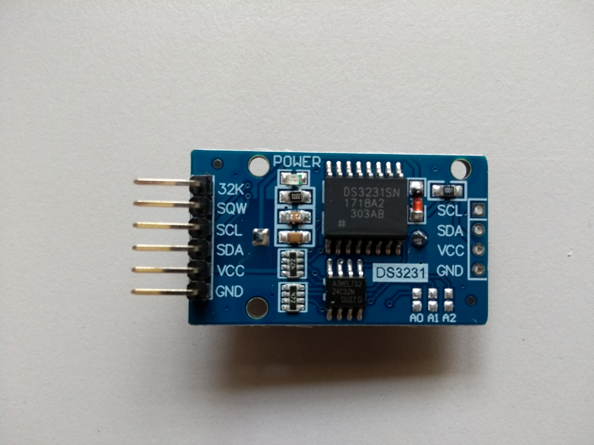

# Hardware infrastructure

### Raspberry Pi

#### General product information:

Raspberry Pi 3 Model B version 1.2

#### Technical product information:

- Quad Core 1.2GHz Broadcom BCM2837 64bit CPU
- 1GB RAM
- BCM43438 wireless LAN and Bluetooth Low Energy (BLE) on board
- 100 Base Ethernet
- 40-pin extended GPIO
- 4 USB 2 ports
- 4 Pole stereo output and composite video port
- Full size HDMI
- CSI camera port for connecting a Raspberry Pi camera
- DSI display port for connecting a Raspberry Pi touchscreen display
- Micro SD port for loading your operating system and storing data
- Upgraded switched Micro USB power source up to 2.5A

#### Retailer information:

[Raspberry Pi foundation](<https://www.raspberrypi.org/products/raspberry-pi-3-model-b/>)

Available for approximately 30€ depending on your local retailer

#### Source code:

### Powerbank

#### General product information:

EasyAcc MegaCharge Doubin 26000mAh Power bank

#### Technical product information:

- Battery capacity: 26000mAh x 3.7V=96.2Wh
- Battery type: Lithium-Ion-Battery
- Input: DC 5V 4A(max) 
- Output: DC 5V 4.8A(max) 
- Dimensions: 6.57 x 3.1 x 0.86 in. / 167x 80 x22 mm 
- Weight: 454g 

#### Retailer information:

[Easyacc](<https://www.easyacc.com/de/670-easyacc-26000mah-power-bank.html>)

Available for approximately 50€ depending on your local retailer

#### Source code:

### Containment box

#### General product information:

Spelsberg TK PC 1811-9-m

#### Technical product information:

Dimensions:

- Width: 180 mm
- Length: 110 mm
- Height: 90 mm
- interior height: 75 mm

Material:

- Base: Polycarbonate, glass-fibre reinforced, grey simila
- Cover: Polycarbonate, glass-fibre reinforced, grey simila
- Sealing: Polyurethane
- Cover screw: Polyamide 6, fiber-glass reinforced

Properties:

- Ingress protection: IP66 - acc. EN 60529 / DIN VDE 0470-1
- Ambient temperature (min.): -35 °C
- Ambient temperature (max.): 80 °C
- Ambient temperature (24 h): 60 °C
- Max. rel. humidity at 40° C: 100%
- Rated insulation voltage AC: 690V
- Impact restistance: {IK08 nach DIN EN 5012 / VDE 0470 Teil 100 }
- Protection class: II - isolate protection acc. VDE 0106 Protective
- PVC-free: √
- Silicone-free: √
- UV resistance: √
- Weatherproof: √
- Combustion behaviour to UL: 5VA nach UL 50 / UL 746C
- Combustion behaviour to UL: {V-2 nach UL 94}
- Combustion behaviour to VDE: 960°C acc. VDE 0471/ EN 60695
- Fitted for outdoor application: √
- Knockouts: √

#### Retailer information:

[ RS Components Handelsgesellschaft](<https://at.rs-online.com/web/p/universalgehause/0832605/>)

Depending on your local retailer available for about 25 €

#### Source code:

# Sensors

Here you will find some information on the different sensors we used in the implementation of the SensorBox. Of course, other sensors for measuring the same or even other environmental variables could be used as well. The listed sensors were chosen due to their low prices but also because they measure the variables of interest to us accurately. For the microphone we tested two different versions, one significantly more expensive than the other one. If the quality of the records of the cheaper microphone would prove well enough, costs could be reduced.

### Camera

------

#### General product information: 

Raspberry Pi Camera Module v2.1

#### Technical product information:

- sensor: Sony IMX219 8 Megapixel sensor
- supported formats: 1080p@30Hz, 720p@60Hz and 640x480p@60/90Hz 
- ribbon cable for CSI-port : 30 cm
- dimensions: 25x24x9 (mm, HxBxD)

#### Manufacturer information:

[Raspberry Pi foundation](https://www.raspberrypi.org/products/camera-module-v2/)

Depending on your local retailer available for about 26 €

#### Sensor usage:

The camera is used to monitor the canopy from below crown surface. The collected data can be used to calculate the greenness-index to compare it with UAV generated aerial RGB-images. Further it can be used to monitor vegetational growth and animal wildlife detection.

#### Source code:

<a href='https://github.com/Nature40/pysensorproxy/blob/master/sensorproxy/sensors/optical.py'>Link to camera class definition at the sensorproxy-repository</a>

### Microphone - expensive version

------

#### General product information:

RØDE - Smartlav+

#### Technical product information:

- microphone type: pressure gradient
- transmission range: 20Hz to 20kHz
- output impedance: 0Ω
- sensitivity: -32.0dB re 1 Volt/Pascal (25.50mV @ 94 dB SPL) +/- 2 dB @ 1kHz
- dimensions: 118x4.50x4.50 (mm; HxWxD)

#### Retailer information:

[RØDE Microphones](http://www.rode.com/microphones/smartlav)

Available for approximately 50€

#### Sensor usage:

The microphone is used to record the singing of birds. This data can be used by a machine learning algorithm to identify bird species. Bird species are an important indicator for biodiversity in forest ecosystems.

In the first stage of development two different models of microphones are tested to evaluate if a cheaper microphone is also suitable for bird species identification.

#### Source code:

[Link to audio class definition at the sensorproxy-repsoitory](https://github.com/Nature40/pysensorproxy/blob/master/sensorproxy/sensors/audio.py)

### Microphone - cheap version

------

#### General product information:

Foxnovo SF-555

#### Technical product information:

- microphone type: condenser
- transmission range: 50Hz to 16kHz
- output impedance: <2.2Ω
- sensitivity: -55.0dB  +/- 2 dB @ 1kHz
- dimensions: 67x12x14 (mm; HxWxD)

#### Retailer information:

[Purchased at Amazon](https://www.amazon.de/Foxnovo-Portable-USB-2-0-Kondensator-Mikrofon-Chat/dp/B00XA01IQC)

Available for approximately 10€.

#### Sensor usage:

The microphone is used to record the singing of birds. This data can be used by a machine learning algorithm to identify bird species. Bird species are an important indicator for biodiversity in forest ecosystems.

In the first stage of development two different models of microphones are tested to evaluate if a cheaper microphone is also suitable for bird species identification.

#### Source code:

[Link to audio class definition at the sensorproxy-repsoitory](https://github.com/Nature40/pysensorproxy/blob/master/sensorproxy/sensors/audio.py)

### Temperature & Humidity Sensor

------

#### General product information:

DHT22 (AM2302) temperature-humidity sensor

#### Technical product information:

- operating voltage: 3-5V
- sensitivity humidity: 0-100% ± 2-5% 
- sensitivity temperature: -40-80°C ±0.5°C
- dimensions: 15.1x25x7.7 (mm, HxBxD)

#### Manufacturer information:

[Adafruit](<https://www.adafruit.com/product/385>)

Depending on your local retailer available for about 10 €

#### Sensor usage:

The temperature and humidity sensor is used to measure micro-climatic data. The lift-system allows to collect the data in a vertical range for advanced climatic modelling.

#### Source code:

[Link to environmental sensor class definition at the sensorproxy-repository.](https://github.com/Nature40/pysensorproxy/blob/master/sensorproxy/sensors/environment.py#13)

### Light Sensor

------

#### General product information:

Adafruit TSL2591 High Dynamic Range Digital Light Sensor

#### Technical product information:

- sensitivity: 188 uLux sensitivity, up to 88,000 Lux input measurements.
- temperature range: -30 to 80 °C
- operating voltage: 3.3-5V 
- dimensions: 19x16x1(mm, HxBxD)

#### Retailer information:

[Adafruit](<https://www.adafruit.com/product/1980>)

Depending on your local retailer available for about 6 €

#### Sensor usage:

The digital light sensor gathers information about the light intensity in the visible an near infrared spectrum. The data can be used to model vegetation density and light distribution at different height-levels. On the SensorBox it is faced upwards and takes measurements at different heights. It is planned to use to data to model forest structural parameters in conjunction with aerial images collected by UAVs. 

#### Source code:

[Link to environmental sensor class definition at the sensorproxy-repository.](https://github.com/Nature40/pysensorproxy/blob/master/sensorproxy/sensors/environment.py#43)

### Hall Sensor

------

#### General product information:

JOY-IT KY-024 Hall Sensor

#### Technical product information:

- Chipset: A3141
- OP-amplifier: LM393

#### Retailer information:

[SensorKit X40](<http://sensorkit.en.joy-it.net/index.php?title=KY-024_Linear_magnetic_Hall_Sensor#Technical_data_.2F_Short_description>)

Available for approximately [3€](<https://www.reichelt.de/entwicklerboards-magnetischer-hallsensor-debo-sens-hall-p239090.html>) depending on your local retailer

#### Sensor usage:

The hall sensor are responsible to control the lift system. The attached magnets at the upper and lower end of the lift build a magnetic field which is measured by the hall sensors. The engine powering the cable car is stopped when the SensorBox reaches the correct level of measurement.

#### Source code:

[Link to the lift class configuration with hall sensors for indicating upper and lower level](https://github.com/Nature40/pysensorproxy/blob/541eac35379bc2d4dc3b24b8412218af6f142d63/sensorproxy/lift.py#38)

### Real-time clock

------

#### General product information:

DS3231 real-time clock

#### Technical product information:

- Accuracy ±2ppm from 0°C to +40°C
- Accuracy ±3.5ppm from -40°C to +85°C
- Battery Backup Input for Continuous
  Timekeeping
- Operating Temperature Ranges
  Commercial: 0°C to +70°C
  Industrial: -40°C to +85°C
- Low-Power Consumption
- Real-Time Clock Counts Seconds, Minutes,
  Hours, Day, Date, Month, and Year with Leap Year
  Compensation Valid Up to 2100
- Two Time-of-Day Alarms
- Programmable Square-Wave Output
- Fast (400kHz) I2C Interface
- 3.3V Operation
- Digital Temp Sensor Output: ±3°C Accuracy
- Register for Aging Trim
- RST Input/Output
- UL Recognized

#### Retailer information:

[Eckstein GmbH](<https://eckstein-shop.de/DS3231-RTC-Modul-LIR2032>)

Available for approximately [4€](<https://eckstein-shop.de/DS3231-RTC-Modul-LIR2032>) depending on your local retailer

#### Sensor usage:

###

#### Source code: