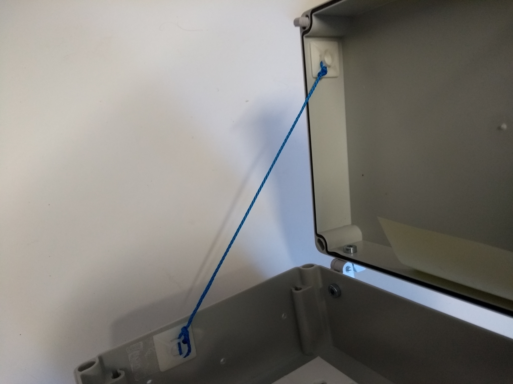
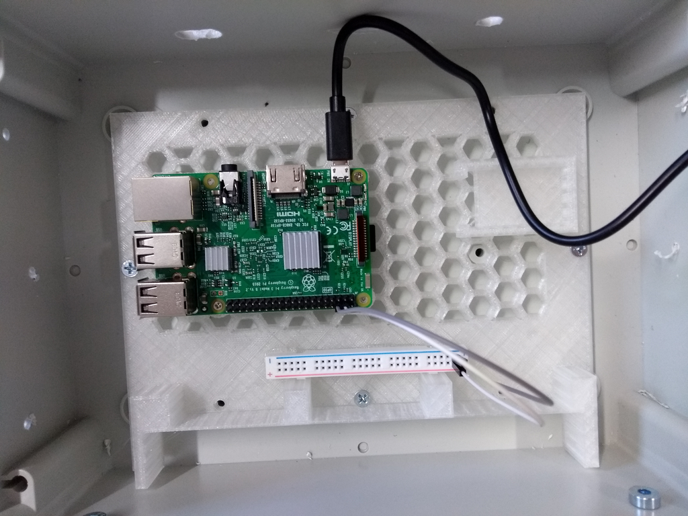
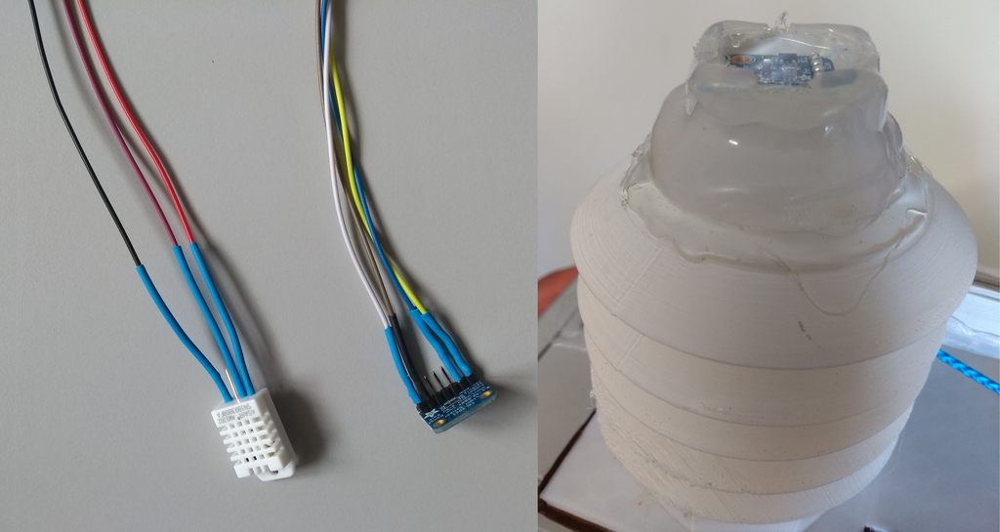
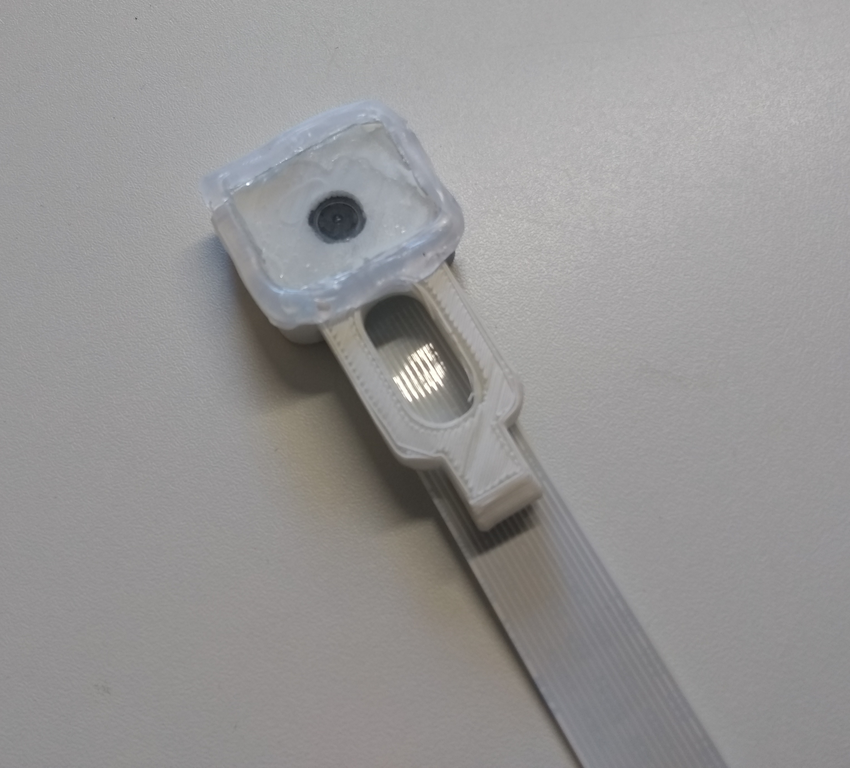
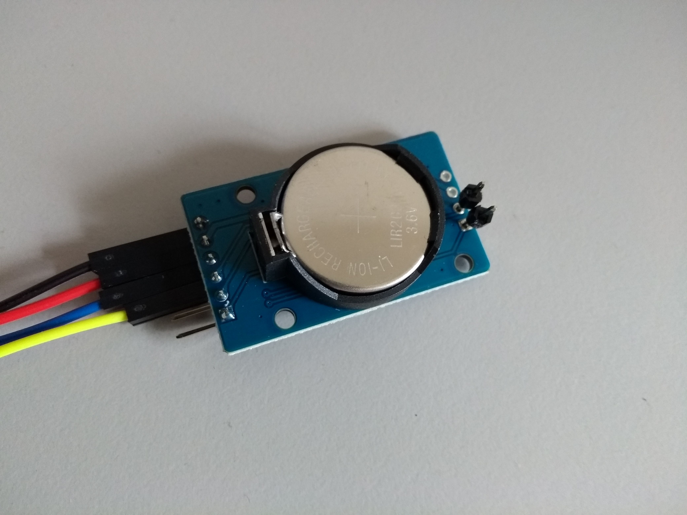
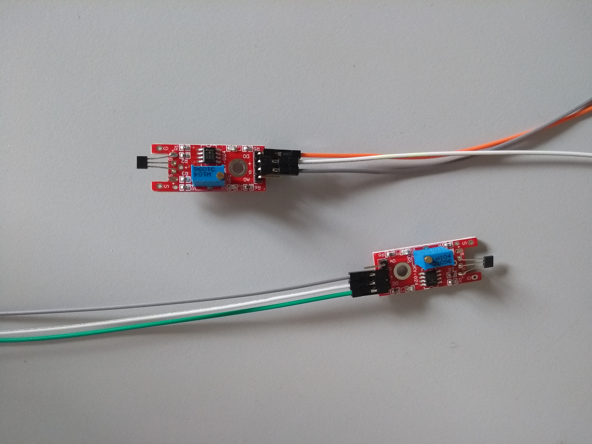
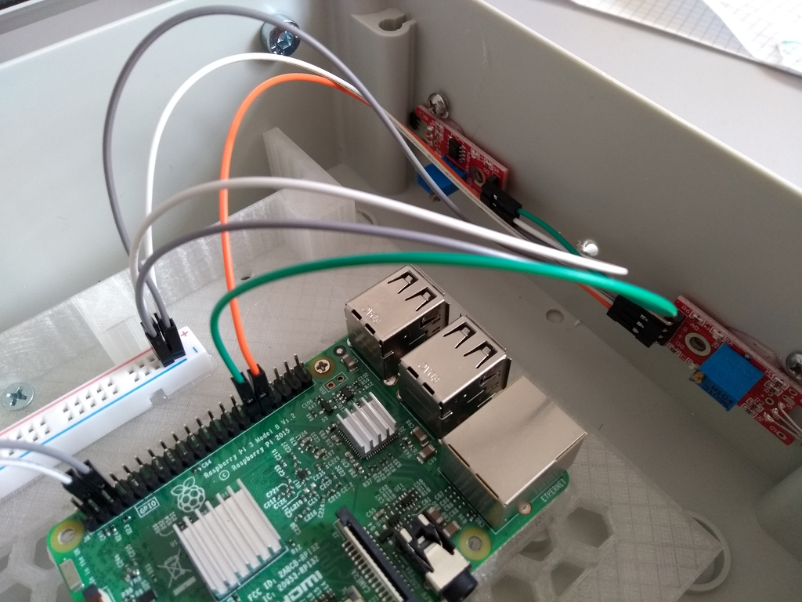
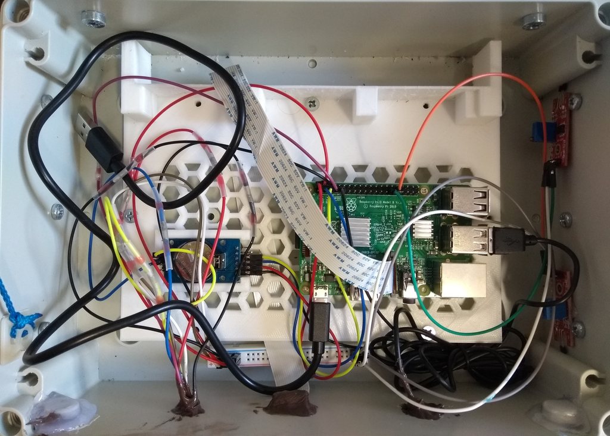

# Assembly

### Full part catalog for SensorBox

[**Hardware**](/001_hardware_infrastructure.html)

- 1x Containment box 
- 1x Raspberry Pie 3 Model B V.2.1
- 1x Powerbank with USB power cable

**[Sensors](/002_sensors.html)**

- 1x Temperature sensor
- 1x Lux-sensor

- 1x Raspberry RGB Camera V.2.1

- 1x Real-time clock

- 2x Hall-sensor

- 1x Microphone expensive or cheap

- 1x Soundcard (for expensive microphone only)

- 1x Audio splitter-cable (for expensive microphone only)

  

**[3d-parts](/003_3d_parts.html)**

- 1x Radiation shield top

- 3x Radiation shield middle 

- 1x Radiation shield bottom

- 1x Raspberry pie mounting plate

- 1x Camera mount

- 1x Sensor-phalanx depend on desired microphone

  

[**Construction Materials**](/004_construction_materials.html)

- 1x Set of hinges

- 1x Heat sink set for Raspberry Pie

- 6x Rolls 

- 1x Pin header with 2 pin
- 2x Slides 25x25mm
- 2x Cable tie sockets
- 100 cm rope (3mm width)
- 30 cm rope (3mm width)
- 1x Breadboard for jumper cables

Screws

- 4x M4x12 screws
- 4x C2,9x13 screws
- 6x M4x16 raised countersunk-head screws
- 6x M4 safety nut
- 6x M4 washers

Jumper-cables

- 1x Jumper-cables male/female in blue, yellow, violet 
- 2x Jumper-cables male/female in white, brown

- 6x Jumper-cables male/female in red, black
- 1x Jumper-cables female/female in violet,orange, green, red, black, 

- 2x Jumper-cables female/female in yellow, blue

## 1. Containment box preparation

- 1x Containment box
- 1x Set of hinges
- 2x Cable tie sockets
- 1x Raspberry Pie
- 1x Heat sink set for Raspberry Pie
- 1x Breadboard for jumper cables
- 1x Powerbank with USB power cable
- 1x Wireless charger
- 6x Rolls 
- 1x Raspberry Pie mounting plate
- 100 cm rope (3mm width)
- 30 cm rope (3mm width)

- 4x M4x12 screws
- 4x C2,9x13 screws
- 6x M4x16 raised countersunk-head screws
- 6x M4 safty nut
- 6x M4 washers
- 1x Jumper-cable male/female in red, black

### 1.1 Drilling holes and attachments

First drill the holes for the hinges with the template from the hinge set at the backside of the containment box. Use a 5mm drill which fit in template and than use a 6mm drill to expand the holes. Install the hinges with the given screws included in the set. Then drill the holes for the sensors on the top of the containment box with the [tower template](images/tower_template.png) . Further drill the holes with 3,5 mm drill for the rolls on both sides using [roll template](images/roll_template.png) .

At least drill the holes for the suspension cable with 4mm drill . Insert the rope in both holes and and fix the ropes with glue. The rope should be at least 80 cm long outside the containment box.  Make sure the glue seals off the drill holes completely. 

Paste the two cable tie sockets in the inner left side of the containment box (see picture below) and connect them with the 30 cm rope. Fix the rope with double knot. 

### 1.2 Attach Rolls

Use the six M4x16 raised countersunk-head screws with washers from inside the containment box to attach the six rolls and secure them with the six safety nuts from outside. Use instant glue under the washers and safety nuts and finally tighten the screws and nuts to ensure water-resistance.

### 1.3 Install Raspy Pi and power supply

Use the four M4x12 screws to attach the Raspberry Pie mounting plate to the containment box. Then paste the heat sinks on the Raspberry Pie. Further put the Raspberry Pie on the sockets of the Raspberry Pie mounting plate with the USB-ports pointing to the right side and fix it with the four C2,9x13 screws.

Take one +/- part from the Breadboard and paste it on the bottom side of the Raspberry Pie mounting plate and connect it with the jumper-cables: red for (+) and black for (-).

Connect the USB-power-cable to the Raspberry Pie. Put the Powerbank on the inner side of the containment box cover.

## 2. Sensor preparation

### 2.1 Lux-Microclimate-Sensor-Tower (LMST)

- 1x Temperature sensor
- 1x Lux-sensor
- 1x Slide 25x25mm
- 1x Radiation shield top
- 3x Radiation shield middle 
- 1x Radiation shield bottom
- 1x Jumper-cables female/female in blue, yellow, violet 
- 1x Jumper-cables male/female in blue, yellow, violet 
- 2x Jumper-cables male/female in white, brown, black, red

First the jumper-cables need to be lengthened. Therefore connect the jumper-cables of  each color with female to male.

Alternatively the jumper-cables can be connected by soldering to improve durability. Here heat-shrink tubings are recommended to seal the cables form wetness. 

Connect the lengthened jumper-cables to the Lux- and Temperature-sensor.

Insert the Lux-Sensor in the mount of the Radiation shield top and paste the slide on the mounted Lux-sensor . Ensure that the glue (glue-gun) is sealing the space between the slide and the mount. Cut some grooves in the cooled off glue to ensure that water can drain.

Connect all Radiation shield middle parts to the Radiation shield top part and lead the jumper cables through the holes.

Paste the Temperature-sensor on the inner side of the mount plate in the Radiation shield bottom part and connect it to the Radiation shield while leading the cables trough the holes.

### 2.2 Camera (CAM)

- 1x Raspberry Pie camera module v.1.2
- 1x 30cm camera-cable
- 1x Camera-mount
- 1x Slide 25x25mm

First connect the 30cm camera-cable to the Raspberry Pie camera module and put it into the Camera-mount. Then close the cap on the backside and paste the slide on the front. Ensure that the glue (glue-gun) is sealing the space between the slide and the Camera-mount. Finally cut some grooves in the cooled off glue to ensure that water can drain if the camera is adjusted horizontally.

### 2.3 Real-time-clock (RTC)

- 1x Real-time-clock
- 1x Jumper-cables female/female in red, black, yellow, blue
- 1x Pin-header with 2 pins

Solder the Pin-header to the Real-time-clock and connect the jumper-cables.

### 2.4 Hall-sensors set

- 2x Hall-sensor

- 2x Jumper-cable male/female red, black

- 1x Jumper-cable female/female orange, green

Connect the jumper-cables and adjust the sensitivity by turning the adjusting-screw on top of the sensors. Use a magnet to test the reaction: The Hall-sensor's lamp should glow if it senses a magnetic field.

## 3. Sensor installation and sealing

- 1x Sensor-phalanx depend on desired microphone
- 1x LMST (prebuild sensor)
- 1x Mircophone expensiv or cheap version
- 1x Soundcard (for expensive microphone only)
- 1x Audio splitter-cable (for expensive microphone only)
- 1x CAM (prebuild sensor)
- 1x Containment box prepared
- 1x Hall-sensor set

First paste both Hall-sensors with glue (gluegun) on the right inner side of the containment box below the screws from the rolls. The one with green jumper-cable in front the one with orange jumper-cable in the back.  

Than paste the RTC in the mount on the Raspberry Pie mounting plate with the battery to the top. At least connect the jumper-cables from the Hall-sensors and RTC to the Raspberry Pie.

Further insert the mircophone (both versions) trough the duct in the Sensor-phalanx and fix it with glue or some tape. For expensive microphone only: connect the soundcard and Audio splitter-cable to the microphone. Then connect the microphone to the Raspberry Pie. Next attach the CAM to the Sensor-phalanx and insert the Camera-cable trough the opening and trough the cable canal. Insert all jumper-cables from the LMST trough the opening in the Sensor-phalanx and attach the LMST. Further fix it with glue.

Insert all cables from the Sensor-phalanx trough the openings in the containment box and paste the Sensor-phalanx to the containment box. Close the bayonet-lock for the LMST by turning it.

Connect all jumper-cables from the sensors to the Raspberry Pie. 

Seal all space between the Sensor-phalanx and the containment box with silicon or glue. Further seal all openings from the inner side of the containment box leading to the sensors with silicon or glue.

