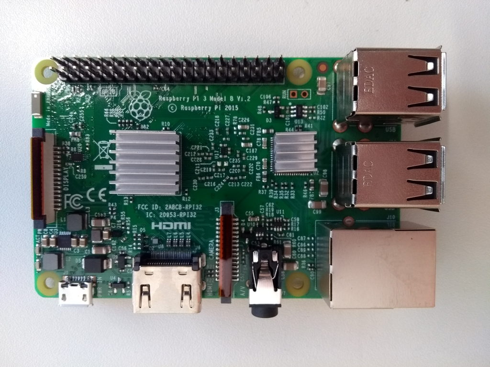
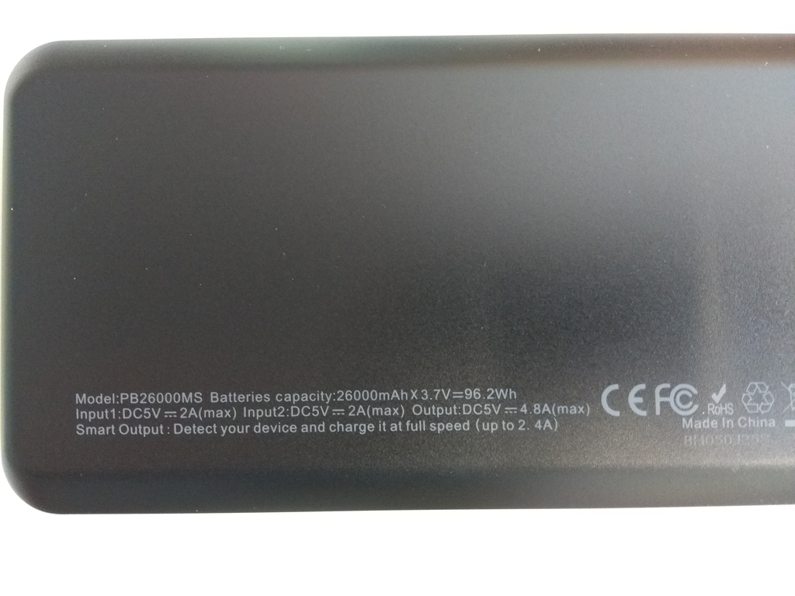

# Hardware infrastructure

### Raspberry Pi

#### Manufacturer product description:

Raspberry Pi 3 Model B version 1.2

#### Technical product information:

- Quad Core 1.2GHz Broadcom BCM2837 64bit CPU
- 1GB RAM
- BCM43438 wireless LAN and Bluetooth Low Energy (BLE) on board
- 100 Base Ethernet
- 40-pin extended GPIO
- 4 USB 2 ports
- 4 Pole stereo output and composite video port
- full size HDMI
- CSI camera port for connecting a Raspberry Pi camera
- DSI display port for connecting a Raspberry Pi touchscreen display
- micro SD port for loading your operating system and storing data
- upgraded switched Micro USB power source up to 2.5A

#### Retailer information:

[Raspberry Pi foundation](<https://www.raspberrypi.org/products/raspberry-pi-3-model-b/>)

Available for approximately 30€ depending on your local retailer

### Powerbank

#### Manufacturer product description:

EASYACC MegaCharge Doubin 26000mAh Power bank

#### Technical product information:

- battery capacity: 26000mAh x 3.7V=96.2Wh
- battery type: Lithium-Ion-Battery
- input: DC 5V 4A(max) 
- output: DC 5V 4.8A(max) 
- dimensions: 6.57 x 3.1 x 0.86 in. / 167x 80 x22 mm 
- weight: 454g 

#### Retailer information:

[Easyacc](<https://www.easyacc.com/de/670-easyacc-26000mah-power-bank.html>)

Available for approximately 50€ depending on your local retailer

### Containment box

#### Manufacturer product description:

SPELSBERG TK PC 1811-9-m

#### Technical product information:

**Dimensions:**

- width: 180 mm
- length: 110 mm
- height: 90 mm
- interior height: 75 mm

**Material:**

- base: Polycarbonate, glass-fibre reinforced, grey simila
- cover: Polycarbonate, glass-fibre reinforced, grey simila
- sealing: Polyurethane
- cover screw: Polyamide 6, fiber-glass reinforced

**Properties:**

- ingress protection: IP66 - acc. EN 60529 / DIN VDE 0470-1
- ambient temperature (min.): -35 °C
- ambient temperature (max.): 80 °C
- ambient temperature (24 h): 60 °C
- max. rel. humidity at 40° C: 100%
- rated insulation voltage AC: 690V
- impact restistance: {IK08 nach DIN EN 5012 / VDE 0470 Teil 100 }
- protection class: II - isolate protection acc. VDE 0106 Protective
- PVC-free
- silicone-free
- UV resistance
- weatherproof
- combustion behaviour to UL: 5VA nach UL 50 / UL 746C
- combustion behaviour to UL: {V-2 nach UL 94}
- combustion behaviour to VDE: 960°C acc. VDE 0471/ EN 60695

#### Retailer information:

[RS Components Handelsgesellschaft](<https://at.rs-online.com/web/p/universalgehause/0832605/>)

Depending on your local retailer available for about 25 €
